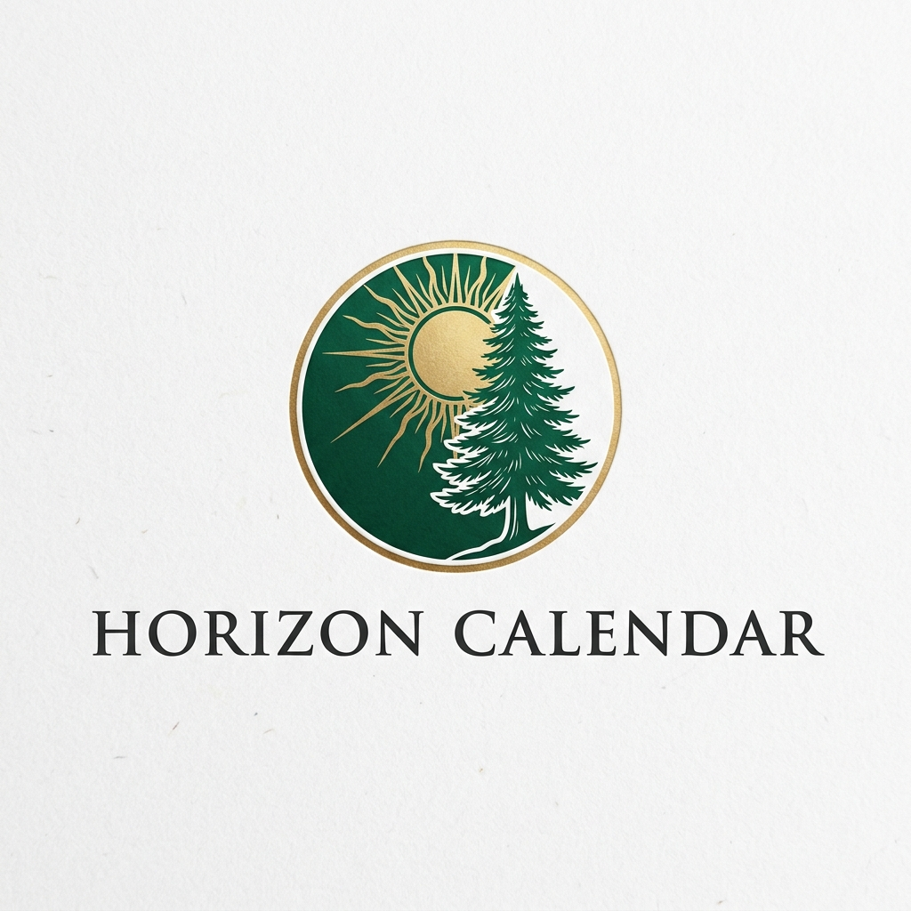

# 🌲 Horizon Calendar 2026
### *Legacy Collection • Nature Edition*

<div align="center">
  
  <p><i>A premium, nature-themed interactive dashboard designed for mindful productivity.</i></p>
</div>

---

## 📝 Project Brief
Horizon is an interactive digital wall calendar that bridges the gap between classic aesthetics and modern functionality. Built as part of a **Software Engineering Summer Intern Task**, this project demonstrates a commitment to high-end UI/UX, modern React patterns, and performance-first styling.

The "Nature Edition" is centered around a "Digital Zen" philosophy—minimizing clutter while providing a tactile, responsive experience for logging daily discoveries and organizing time.

## 🚀 Technical Highlights
This project was developed using a cutting-edge stack to showcase technical proficiency with the latest web standards:

- **Next.js 16 (App Router)**: Utilizing the latest React 19 features including improved `useActionState` compatibility and optimized Server Components.
- **Tailwind CSS v4**: Leveraging the new high-performance Oxide engine and CSS-first configuration for a streamlined build process.
- **Framer Motion 12**: Implementing advanced physics-based micro-animations for month transitions and UI interactions.
- **Date-Fns Architecture**: Robust date manipulation handling complex intervals and range selections.
- **Zero-Latency Persistence**: LocalStorage integration for instant data retrieval without the overhead of external database calls for a personal-first experience.

## ✨ Key Features
- **Fluid Timeline Navigation**: Seamless transitions between months with physics-based directionality.
- **Discovery Logging**: A dedicated space for capturing daily observations, reflections, and "Records of the Day."
- **Intelligent Date Selection**: Support for single-day focus and multi-day range highlights.
- **Immersive Theming**: A bespoke Dark/Light mode toggle that shifts the interface between a bright "Morning" aesthetic and a deep "Twilight" forest mode.

## 🛠️ Installation & Setup

1. **Clone & Install**:
   ```bash
   npm install
   ```

2. **Run Development Server**:
   ```bash
   npm run dev
   ```

3. **Build for Production**:
   ```bash
   npm run build
   ```

## 📁 Project Structure
- `src/app/page.js`: The core logic container, managing state for dates, ranges, and notes.
- `src/app/globals.css`: The central design system powered by Tailwind v4 `@theme`.
- `public/`: High-resolution assets for the immersive nature backdrop and branding.

## 🌐 Deployment

The project is optimized for deployment on **Vercel** with the following configuration:

- **Framework Preset**: Next.js
- **Node.js Version**: 20.x or 22.x
- **Build Command**: `npm run build`
- **Output Directory**: `.next`
- **Root Directory**: `./` (Default)

### Live Demo
> [!TIP]
> **Live Link**: [Your Vercel URL Here]

---

## ✅ Intern Task Checklist
This project addresses the core requirements of the SWE Intern assessment:

- [x] **Responsive UI**: Tested on Mobile, Tablet, and Desktop.
- [x] **Theme Stability**: Fully functional Dark/Light mode toggle with persistence.
- [x] **Data Integrity**: Notes are saved and retrieved correctly across sessions using LocalStorage.
- [x] **Modern Tooling**: Implemented with Next.js 16 + Tailwind v4 + Framer Motion.
- [x] **Code Quality**: Structured into reusable sub-components with a clean, centralized style architecture.

---
*Developed for the SWE Summer Intern  2026 - takeuforward*
